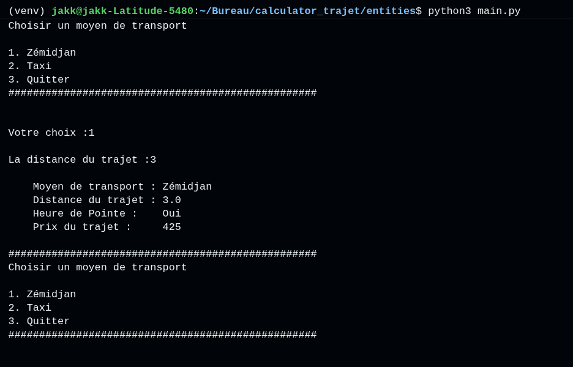
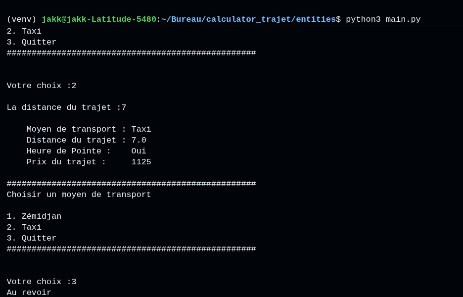

# Calculator Trajet

## Lancer le projet avec GitHub Codespaces

1. Ouvrir le dépôt GitHub du projet.
2. Cliquer sur **Code**.
3. Sélectionner **Codespaces**.
4. Cliquer sur **Create codespace on main**.
5. Une fois le Codespace ouvert, exécuter :

```bash
python3 src/main.py
```

---

## Cloner le projet

Cloner le dépôt avec :

```bash
git clone https://github.com/JeanJAKK/calculator_trajet.git
```

Accéder au projet :

```bash
cd calculator_trajet
```

Puis lancer l'application :

```bash
python3 src/main.py
```

---

## Exemple

Exemple d'exécution du programme :

```text
La distance du trajet : 2

Moyen de transport : Zémidjan
Distance du trajet : 3.0
Heure de Pointe :   Oui
Prix du trajet :    425
```

### Capture d'écran




_JeanJAKK_
